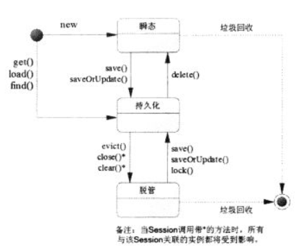
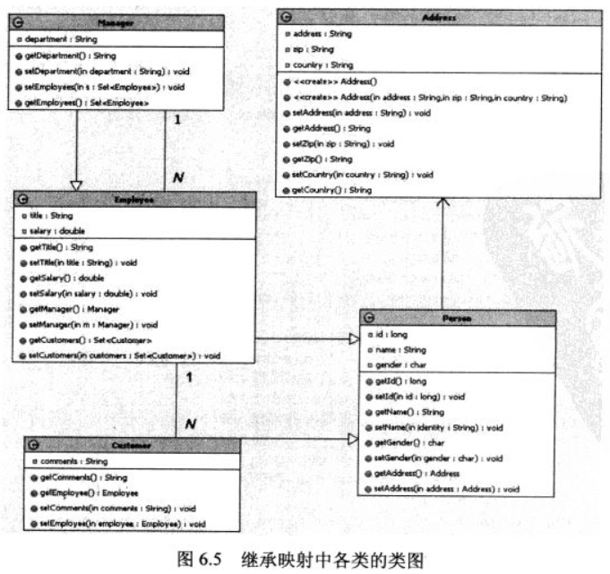

# LearnHibernate #

[Hibernate Reference Documentation](http://docs.jboss.org/hibernate/orm/4.3/manual/en-US/html_single/)

# 预备工作 #

MySQL 5.5 

创建learnhibernate数据库

# Hibernate基础教程目录 #

- [ORM与Hibernate](#)

- [Hibernate入门](#)

- [Hibernate体系结构](#)

- [深入Hibernate配置文件](#)

- [深入理解持久化对象](#)

- [深入Hibernate的映射文件](#)

- [映射组件属性](#)

- [使用注解标注实体](#)

# Hibernate高级教程目录 #

# 为了使用Hibernate进行持久化操作 #

- 开发持久类，由POJO加映射文件组成
- 获取Configuration
- 获取SessionFactory
- 获取Session，打开事务
- 用面向对象的方式操作数据库
- 关闭事务，关闭Session

# 随PO与Session的关联关系，PO有三个状态 #

- 瞬时Transient：PO实例未与Session关联过
- 持久化Persistent：若PO实例与Session关联起来，且该实例对应到数据库记录
- 脱管Detached：若PO实例曾与Session关联过，但因为Session关闭，PO脱离了Session管理

# Hibernate与JDBC操作数据库的方式，有两个显著优点： #

- 无需使用过多SQL语句，而且允许OO方式访问数据库
- JDBC访问构成中大量checked异常被包装成Hibernate的Runtime异常，从而不再要求程序必须处理所有异常。

# Hibernate 架构 #

# Hibernate配置方式 #

- hibernate.properties
- hibernate.cfg.xml
- 不使用任何配置文件，以硬编码方式创建Configuration

# load()方法和get()方法的主要区别在于是否延迟加载 #

load()方法将具有延迟加载功能，load()方法不会立即访问数据库，当试图加载的记录不存在的，load()方法可能返回一个未初始化的代理对象

get()方法总是立即访问数据库，当试图加载记录不存在时，get()方法将直接返回null

lock()跟事务处理transaction handling

# 代码示例 #

[Hello Hibernate](src/main/java/com/lun/helloworld/StoreData.java) hibernate的简单用例

[StoreData2](src/main/java/com/lun/helloworld/StoreData2.java) 不用配置文件，使用硬编码方式配置

[Formula](src/main/java/com/lun/light/mapfile/formula) 映射主键MySQL 自增 indentity, @Formula运用，formula指定该属性值没有对应的实际数据列该属性值将由系统根据表达式来生成

[Generated](src/main/java/com/lun/light/mapfile/generated) @Generated(GenerationTime.ALWAYS)表述的属性值由数据库生成（如触发器），而Hibernate会在每次插入、更新之后执行select语句来查询该属性值

映射集合属性，（集合的可以不用添加多个实体类，数据库会创建多个库）

[List](src/main/java/com/lun/light/mapfile/list) 映射List集合属性

[Array](src/main/java/com/lun/light/mapfile/array) 映射数组集合属性（同List相似）

[Set](src/main/java/com/lun/light/mapfile/set) 映射Set集合属性（无需使用list-index元素来映射集合元素的索引值）

<bag/&gt; 可映射List，Set，Collection无序集合，集合属性对应的表没有主键

[Map](src/main/java/com/lun/light/mapfile/map) 映射Map属性

## 集合属性性能分析 ##

lazy = "true",懒加载

1——N关联的1的一端通常带有**inverse="true"**,对于这种关联映射，1的一端不再控制关联关系，**所有更新操作将会在N的一端进行处理**，这种情况下使用list和bag映射属性将有较好的性能，因为我们可以在未初始化集合元素的情况下直接向bag或list添加新元素

# 有序集合映射 #

[SortedSet](src/main/java/com/lun/light/mapfile/sortedset) TreeSet的实现

[OrderBy](src/main/java/com/lun/light/mapfile/orderby) @OrderBy("training_name desc") 和 HashSet

有时候希望在映射文件中创建和删除触发器、存储过程等数据库对象、Hibernate提供<database-object/&gt;

[data-object](src/main/java/com/lun/light/mapfile/dataobject) 用<database-object/&gt; 创建触发器

SchemaExport

The SchemaExport tool writes a DDL script to standard out and/or executes the DDL statements.

CDMQ 长岛迷情 授权新用户-创建表-插入数据-查数据

>数据控制语言DCL control - grant commit
>数据定义语言DDL define - create table
>数据操纵语言DML manipulate - insert
>数据查询语言DQL Query - select

TODO:5.6还有书上没有提及的源码，稍后再跑

# 映射组件属性 #

[Person-Name](src/main/java/com/lun/light/component/componentcollection) 基本使用

组件属性的意思是：持久化类的属性并不是基本数据类型，也不是字符串，日期等标量类型的变量，而是一个复合类型的对象，在持久化的过程中，它仅仅被当作值的类型，而并非引用另一个持久化实体。

<component/&gt; @Embeddable @Parent

## 组件属性为集合 ##

如果组件类再次包括了List、Set、Map等集合属性，在<component/&gt;元素里使用<list/&gt;、<set/&gt;、<map/&gt;

[Person-Name](src/main/java/com/lun/light/component/componentcollection) component里有Map

[Person-Name-Score](src/main/java/com/lun/light/component/collectioncomponent)

## 集合属性的元素为组件 ##

<composite-element/&gt; 已弃用

## 组件作为Map的索引 ##

[map key component](src/main/java/com/lun/light/component/mapkeycomponent/Name.java)

## 组件作为符合主键 ##

[embeddedid](src/main/java/com/lun/light/component/embeddedid)

[ids](/LearnHibernate/src/main/java/com/lun/light/component/compositeid)

## 嵌套类@Embeddable、@EmbeddedId ##

[embeddedid2](src/main/java/com/lun/light/component/embeddable2)

[embedded](src/main/java/com/lun/light/component/embedded)

---

# 深入使用Hibernate #

## Hibernatede的关联映射 ##

- [单向关系](src/main/java/com/lun/light/unidirectional)
	- 1-1
	- 1-N
	- N-1
	- N-N
- [双向关联](src/main/java/com/lun/light/bidirectional)
	- 1-1
	- 1-N
	- N-N

双向关系没有N-1，因为双向关系1-N和N-1是完全相同

[组件属性包含的关联实体](src/main/java/com/lun/light/componententity)

[基于复合主键的关联关系](src/main/java/com/lun/light/one2ncompositeid)

> What's Hibernate @OneToMany mappedBy used for?

>MappedBy signals hibernate that the key for the relationship is on the other side.

>This means that although you link 2 tables together, only 1 of those tables has a foreign key constraint to the other one. MappedBy allows you to still link from the table not containing the constraint to the other table.

>[Can someone please explain mappedBy in hibernate?](https://stackoverflow.com/questions/9108224/can-someone-please-explain-mappedby-in-hibernate)

### 持久化的传播性 ###

麻烦之处：

当程序总有两个关联实体是，程序需要主动保存、删除或重关联每个持久化实体，若需处理多个彼此关联实体，则需要依次保存每个实体

从DB建模的角度来看，两表间的1-N关联关系总是用外键约束来表示，其中保留外键的数据表被称为从表，被从表参照的数据表被称为主表

对于上述主从表约束关系，Hibernate则有两种映射策略：

- 将从表记录映射成持久化类的组件
- 将从表记录映射成持久化实体

解决之道：Cascade,级联操作

对主的动作，将会影响到从的性质

## 继承映射 ##

[joined](src/main/java/com/lun/light/inheritance/joined) 父表有子表的记录，子表只记录负责特有的列

[singletable](src/main/java/com/lun/light/inheritance/singletable) 只有一表，特有属性大有为null

[tableperclass](src/main/java/com/lun/light/inheritance/tableperclass) 表每一个类，所有表都有应有的列，当主键不能用独表自增策略

上属横向分割映射

## 批量处理 ##

### 批量插入 ###

若100000条数据，按普通的方法一条条save()的话，会抛出OutOfMemoryException，这是因为Hibernate的Session持有一个必选的一级缓存，所有实例将在缓存区进行了缓存的缘故

解决之道：定时将Session缓存的数据刷入数据库

另外也要关闭二级缓存

[批量插入](src/main/java/com/lun/light/batch/insert)

### 批量更新 ###

定时将Session缓存的数据刷入数据库，同样适用批量更新

若需返回多行数据，应使用scroll()方法，从而可以充分利用服务器端的游标所带来的性能优势。

[批量更新](src/main/java/com/lun/light/batch/update)

但上述批量更新效率不高，因为需要先执行数据查询，然后再执行数据更新，且逐行更新，

DML风格的批量更新，会高效

### DML风格的批量更新/删除 ###

使用HQL形式，底层操作实际上是由JDBC完成的

[批量更新2](src/main/java/com/lun/light/batch/update)

[批量删除](src/main/java/com/lun/light/batch/delete)

## 使用HQL查询 ##

Hibernate Query Language

使用HQL的步骤

1. 获取Hibernate Session对象
2. 编写HQL语句
3. 以HQL语句作为参数，调用Session的createQuery()创建查询对象
4. 若HQL语句包含参数，则调用Query的setXxx()为参数赋值
5. 调用Query对象的list()等方法返回查询结果列表（持久化实体集）

HQL语句对大小写敏感

[Hello HQL](src/main/java/com/lun/light/hql/hello)

### The from clause ###

	from Cat as cat

### Associations and joins ###

	from Cat as cat
	    inner join cat.mate as mate
	    left outer join cat.kittens as kitten

	from Cat as cat left join cat.mate.kittens as kittens

	from Formula form full join form.parameter param

---

The supported join types are borrowed from ANSI SQL:

- inner join

- left outer join

- right outer join

- full join (not usually useful)

简写 （去掉inner,outer）

	from Cat as cat
	    join cat.mate as mate
	    left join cat.kittens as kitten

使用HQL的关键词with

	from Cat as cat
	    left join cat.kittens as kitten
	        with kitten.bodyWeight > 10.0

**fetch**

用fetch带出实体集合，针对**懒加载**

A "**fetch**" join allows associations or collections of values to be initialized along with their parent objects using **a single select**. 

This is particularly useful in the case of a collection.

It effectively overrides the outer join and lazy declarations of the mapping file for associations and collections.

	from Cat as cat
	    inner join fetch cat.mate
	    left join fetch cat.kittens

fetch all properties 关键词 lazy=true

	from Document fetch all properties order by name

### Forms of join syntax ###

明式（有join等关键字） 和 隐式（没有join等，如下）

	from Cat as cat where cat.mate.name like '%s%'

[隐式join](src/main/java/com/lun/light/hql/implicit)

### The select clause ###

	select mate
		from Cat as cat
	    inner join cat.mate as mate

	select cat.mate from Cat cat

	select cat.name from DomesticCat cat
	where cat.name like 'fri%'

	select cust.name.firstName from Customer as cust

---

Queries can return multiple objects and/or properties as **an array of type Object[]**:（List<Object[]>）

	select mother, offspr, mate.name
	from DomesticCat as mother
	    inner join mother.mate as mate
	    left outer join mother.kittens as offspr

or as a **List**

	select new list(mother, offspr, mate.name)
	from DomesticCat as mother
	    inner join mother.mate as mate
	    left outer join mother.kittens as offspr

or **assuming** that the class **Family** has an appropriate constructor - as an actual typesafe Java object:

	select new Family(mother, mate, offspr)
	from DomesticCat as mother
	    join mother.mate as mate
	    left join mother.kittens as offspr

You can assign aliases to selected expressions using as:

	select max(bodyWeight) as max, min(bodyWeight) as min, count(*) as n
	from Cat cat

This is most useful when used together with select new map:

	select new map( max(bodyWeight) as max, min(bodyWeight) as min, count(*) as n )
	from Cat cat

This query returns a **Map** from aliases to selected values.

	key 就是 as 后的别名

### Aggregate functions ###

	select avg(cat.weight), sum(cat.weight), max(cat.weight), count(cat)
	from Cat cat

- avg(...), sum(...), min(...), max(...)

- count(*)

- count(...), count(distinct ...), count(all...)

### Polymorphic queries ###

	from Cat as cat

returns instances not only of Cat, but also of subclasses like DomesticCat. 

Hibernate queries can name any Java class or interface in the from clause. 

The query will return instances of all persistent classes that extend that class or implement the interface. 

### The where clause ###

The where clause allows you to refine the list of instances returned. If no alias exists, you can refer to properties by name:

	from Cat where name='Fritz'

If there is an alias, use a qualified property name:

	from Cat as cat where cat.name='Fritz'

This returns instances of Cat named 'Fritz'.

### 表达式 ###

很强大，具体查看官档

### The order by clause ###

The list returned by a query can be ordered by any property of a returned class or components:

	from DomesticCat cat
	order by cat.name asc, cat.weight desc nulls first, cat.birthdate

The optional asc or desc indicate ascending or descending order respectively.

The optional nulls first or nulls last indicate precedence of null values while sorting.

### The group by clause ###

A query that returns aggregate values can be grouped by any property of a returned class or components:

	select cat.color, sum(cat.weight), count(cat)
	from Cat cat
	group by cat.color

	select foo.id, avg(name), max(name)
	from Foo foo join foo.names name
	group by foo.id

A having clause is also allowed.

	select cat.color, sum(cat.weight), count(cat)
	from Cat cat
	group by cat.color
	having cat.color in (eg.Color.TABBY, eg.Color.BLACK)

### Subqueries ###

子查询

	from Cat as fatcat
	where fatcat.weight > (
	    select avg(cat.weight) from DomesticCat cat
	)

	from DomesticCat as cat
	where cat.name = some (
	    select name.nickName from Name as name
	)

	from Cat as cat
	where not exists (
	    from Cat as mate where mate.mate = cat
	)

	from DomesticCat as cat
	where cat.name not in (
	    select name.nickName from Name as name
	)

	select cat.id, (select max(kit.weight) from cat.kitten kit)
	from Cat as cat

### 命名查询 ###

[@NamedQuery](src/main/java/com/lun/light/hql/named) @NamedQuery修饰在实体的查询

## 面象条件查询 ##

面象条件查询具有面向对象编程特色的数据查询方式

面象条件查询通过如下三个类完成：

- Criteria 代表一次查询
- Criterion(标准) 代表一个查询条件
- Restrictions 产生查询条件的

执行面象条件查询的步骤如下

- 获取Hibernates的Session对象
- 以Session对象创建Criteria对象
- 使用Restrictions的静态方法创建Critertion查询条件
- 向Criteria查询中**添加**Criterion查询条件
- 执行Citeria的list()等方法返回结果集。

[Hello Criteria](src/main/java/com/lun/light/criteria/hello) 基本用法动态关联

[Projection](src/main/java/com/lun/light/criteria/projection) 聚合、投影和分组

The **DetachedCriteria** class allows you to create a query outside the scope of a session and then execute it using an arbitrary Session.

[DetachedCriteria](src/main/java/com/lun/light/criteria/detached) 离线查询Session的使用

## SQL ##

addEntity():将查到的记录与特定的实体关联
addScalar():将查询的记录关联成标量值

SQL查询步骤

1. 获取Hibernate Session
2. 编写SQL语句
3. 以SQL语句作参数，调用Session的createSQLQuery方法创建查询对象
4. 调用SQLQuery对象的addScalar()或addEntity()方法将选出的结果与标量值或实体进行关联，分别用于进行标量查询或实体查询
5. 若SQL语句包含参数，则调用Query的setXxx为参数赋值。
6. 调用Query的list()返回查询结果集。

[NativeSQL](src/main/java/com/lun/light/sql/nativesql) 标量查询、实体查询、JavaBean查询、关联继承

[NamedSQL](src/main/java/com/lun/light/sql/namedsql) 命名SQL查询、调用存储过程

Hibernate提供了极好的可扩展性，通过使用定制SQL可以完全控制Hibernate底层持久化所用SQL语句

[CustomSQL](src/main/java/com/lun/light/sql/customsql) 定制SQL

## 数据过滤 ##

[Filter](src/main/java/com/lun/light/filter) 数据过滤使用

## 事务控制 ##

事务是一步或几步基本操作组成的逻辑执行单元，这些基本操作作为一个整体执行单元，它们要么全部执行，要么全部取消，觉不能执行部分。

事务具备4特性 ACID酸性

1. 原子性Atomicity 事务是应用中不可再分的最小逻辑执行体
2. 一致性Consistency 联想AB转账过程，保持AB前后状态一致，一致性是通过原子性保证的
3. 隔离性isolation 各事务间不能相互影响
4. 持久性durability 事务一旦提交，永久存入数据库

SessionFactory 线程安全

Session 线程不安全

Hibernate 的所有持久化访问都必须在Session管理下进行，但并不推荐因为一次简单的数据库原子调用，就打开和关闭一次Session，数据库事务也如此。

Hibernate建议采用每个请求对应一次Session的模式——因为一次请求通常表示需要执行一个完整的业务功能，这个功能由系列的数据库原子操作支撑，而且他们应该是一个逻辑上的整体。

每次HTTPSession对应一次Hibernate Session的模式会导致应用程序无法扩展并发用户的数量，因此不推荐使用。

实际应用中机场需要面对这种应用程序长事务，Hibernate有3中模式解决问题

1. 自动版本化：Hibernate能够自动进行乐观并发控制

2. 脱管对象：Hibernate允许把脱管对象重新关联到Session上，并且对修改进行持久化

3. 长声明周期Session

长生命周期Session可能因内存过多会导致OutOfMemoryException(解决之道：clear())

在脱管状态下，访问一个实体所拥有的集合(teacher.getStudents().size())，或者访问其指向代理的属性时，都会引发LazyInitializationException(解决之道：Spring的OpenSessionInView,Hibernate.initialize()或)

### 上下文相关的Session ###

将线程不安全的Session绑定限制在当前线程内——也就是实现一种"上下文相关的"Session

通过hibernate.current_session_context_class

可由jta、thread、managed实现

thread 独立Hibernate应用常用，Hibernate的Session会随着getCurrentSession()方法自动打开，并随着事务提交自动，非常方便。

Spring提供了关于Hibernate的Session事务的管理的完美解决方案。

## 二级缓存和查询缓存 ##

Hibernate 包括两个级别的缓存

- 默认总是启用Session的一级缓存
- 可选的SessionFactory级别的二级缓存

sess.evict(news);//剔除实体

[SecondCache](src/main/java/com/lun/light/secondcache)

**查询缓存**

一二级缓存都是对整个实体进行缓存，它不会缓存普通属性，如果相对普通属性进行缓存，则考虑使用查询缓存

查询缓存并不能提高性能，慎重使用

对于查询缓存来说，它**缓存key**就是查询所用的**HQL或SQL语句**，需要指出的是：查询缓存不仅要求所使用的HQL语句、SQL语句相同，甚至要求传入的参数也相同，Hibernate才能字节从查询缓存中取得数据。

[queryCache](src/main/java/com/lun/light/queryCache) 查询缓存的使用

## 事件机制 ##

通过事件框架，Hibernate允许应用程序能响应特定内部事件，从而允许实现某些通用的功能，或者对Hibernate功能进行扩展。

- 拦截器机制：对于特定动作拦截，回调应用中的特定动作
- 事件系统：重写Hibernate的事件监听器

### 拦截器机制 ###

通过Interceptor接口

- 可以从Session中回调应用程序的特定的方法，这种回调机制可让应用程序在持久化对象被保存、更新、删除或加载之前，检查并修改其属性。
- 可以在数据进入数据库只爱你，对数据进行最后的检查，如果数据不符合要求，可以修改数据，从而避免非法数据进入数据库。

[Interceptor](src/main/java/com/lun/light/interceptor)

### 事件系统 ###

事件系统可以替代拦截器，亦可作为拦截器补充作用

基本上，session接口的每个方法都有对应的事件，比如LoadEvent、FlushEvent等。当Session调用某种方法时，Hibernate Session会产生对应的事件，并激活对应的事件监听器。

[Eventframe](src/main/java/com/lun/light/eventframe)